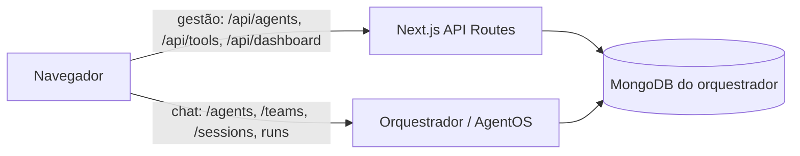

# Playground do Orquestrador

> **[English version below](#english-version)**

Interface web para o [Orquestrador IA Python Agno](https://github.com/Mosfet04/orquestradorIAPythonArgo): configura agentes e tools HTTP, testa no chat e mostra métricas de uso.

> **Baseado no [agno-agi Agent UI](https://github.com/agno-agi/agent-ui)**, adaptado para o orquestrador.


## O que tem hoje

- **Playground de chat** (`/playground`): conversa com agents e teams do orquestrador, com streaming, tool calls, histórico de sessões (formato `chat_history` do Agno 2.5 e o legado) e mídia (imagem, áudio, vídeo).
- **Agentes** (`/agents`, `/agents/new`, `/agents/<id>`): criar, editar, excluir, buscar e filtrar; modelo, prompt, tools associadas e RAG.
- **Tools HTTP** (`/tools`, `/tools/new`, `/tools/<id>`): método, URL, endpoint, headers e parâmetros.
- **Dashboard** (`/dashboard`): agentes ativos, usuários, sessões de agent e de team, tokens por entidade e atividade no período.
- **Primeiros passos** (`/`): guia com atalhos para criar agente, tool e testar.
- Cada seção tem endereço próprio (favoritar, nova aba, voltar do navegador); tema claro/escuro; pt-BR e EN.
- Estados de carregando, vazio e erro em todas as telas: com o orquestrador ou o MongoDB fora, a tela mostra o erro com "Tentar de novo", e um endereço inexistente mostra o 404 dentro do app.

## Como funciona hoje


```mermaid
graph LR
    B[Navegador] -->|gestão: /api/agents, /api/tools, /api/dashboard| N[Next.js API Routes]
    N --> M[(MongoDB do orquestrador)]
    B -->|chat: /agents, /teams, /sessions, runs| O[Orquestrador / AgentOS]
    O --> M
```

- **Gestão** (agentes, tools, dashboard): as rotas `src/app/api/**` leem e gravam direto no MongoDB do orquestrador, com validação zod na entrada.
- **Chat**: o navegador fala direto com o AgentOS do orquestrador no endpoint do painel (padrão `http://localhost:7777`, salvo no `localStorage`). O orquestrador libera `http://localhost:3000` no CORS por padrão. Se o orquestrador exigir chave (`API_KEY_RUN`), o chat não funciona ainda: o envio da chave chega com o BFF (fase P2).
- **Quando a mudança vale**: o orquestrador monta agentes e tools ao iniciar. O que você cria ou edita aqui fica gravado no MongoDB e passa a valer no chat **depois de reiniciar o orquestrador**. A aplicação a quente pela API Admin do orquestrador é o plano das fases P2–P4 ([roadmap](docs/roadmap/README.md)).

## Dados no MongoDB

#### `agents_config`
```json
{
  "id": "assistant-general",
  "nome": "Assistente Geral",
  "model": "llama3.2:latest",
  "factoryIaModel": "ollama",
  "descricao": "Assistente para tarefas gerais",
  "prompt": "Você é um assistente útil...",
  "active": true,
  "tools_ids": ["weather-api"],
  "rag_config": {
    "active": true,
    "doc_name": "knowledge_base",
    "model": "text-embedding-3-small",
    "factoryIaModel": "openai"
  },
  "created_at": "2025-08-17T10:00:00.000Z",
  "updated_at": "2025-08-17T10:00:00.000Z"
}
```

#### `tools`
```json
{
  "id": "weather-api",
  "name": "Weather API",
  "description": "Obtém informações meteorológicas",
  "http_config": {
    "base_url": "https://api.openweathermap.org",
    "method": "GET",
    "endpoint": "/data/2.5/weather",
    "headers": { "API-Key": "<valor-do-header>" },
    "parameters": [
      { "name": "q", "type": "string", "description": "Nome da cidade", "required": true },
      { "name": "units", "type": "string", "description": "Unidade de temperatura", "required": false }
    ]
  },
  "created_at": "2025-08-17T10:00:00.000Z",
  "updated_at": "2025-08-17T10:00:00.000Z"
}
```

Tipos de parâmetro aceitos (os do orquestrador): `string`, `integer`, `float`, `boolean`, `object`, `array`. A `description` da tool e de cada parâmetro é obrigatória.

> **Atenção:** o valor dos headers fica em texto no MongoDB e aparece no editor da tool. Até a referência a segredo (`env:`/`file:`) chegar (P2+), não guarde ali uma chave que não possa ser lida por quem acessa o banco ou o playground.

#### `agno_sessions` e `agno_memories`
Sessões (agents e teams, com as métricas de tokens que o dashboard lê) e memórias de usuário do Agno. Até a v2.4 se chamavam `storage` e `user_memories`.

## Início rápido

**Pré-requisitos:** Node.js 22.18+ ou 24+, pnpm 10.33.0 (só pnpm) e o orquestrador rodando com o MongoDB dele ([README do orquestrador](https://github.com/Mosfet04/orquestradorIAPythonArgo)).

```bash
git clone <este-repositorio>
cd playgroundOrquestrador
pnpm install
```

Crie o `.env.local` com o mesmo MongoDB do orquestrador (são as duas únicas variáveis que o playground lê, em `src/lib/mongodb.ts`):

```env
MONGO_CONNECTION_STRING=mongodb://localhost:27017
MONGO_DATABASE_NAME=agno
```

```bash
pnpm dev          # http://localhost:3000
```

No `/playground`, confira o endpoint do orquestrador no painel (padrão `http://localhost:7777`).

**Dados de exemplo (opcional):** os scripts são do `mongosh` e usam o banco `agno`.

```bash
mongosh "mongodb://localhost:27017" sample-data.js          # 3 agentes e 4 tools de exemplo
mongosh "mongodb://localhost:27017" cleanup-sample-data.js  # remove os exemplos
```

**Produção:** `pnpm build` e `pnpm start` (as variáveis `MONGO_*` precisam existir também no build). O repositório não tem Dockerfile.

## Como usar

1. Em **Tools → Nova tool**, cadastre a chamada HTTP. Exemplo: ID `weather-api`, método `GET`, URL base `https://api.openweathermap.org`, endpoint `/data/2.5/weather`, header `API-Key` (o valor fica em texto no MongoDB, ver o aviso em "Dados no MongoDB"), parâmetros `q` (string, obrigatório) e `units` (string, opcional).
2. Em **Agentes → Novo agente**, escolha provedor e modelo (ex.: Ollama, `llama3.2:latest`), escreva o prompt, marque as tools e, se quiser, ligue o RAG.
3. Reinicie o orquestrador para ele carregar o que mudou.
4. No **Playground**, escolha o agente e converse.

**Provedores no formulário de agente:** Ollama, OpenAI, Anthropic, Google Gemini, Groq e Azure OpenAI; no RAG: Ollama, OpenAI, Google Gemini e Azure OpenAI. As chaves dos provedores ficam no orquestrador, não aqui. Para oferecer outro provedor, inclua-o em `modelProviders` ou `ragProviders` (`src/components/management/agents/AgentForm.tsx`), com um valor que o orquestrador aceite.

## Interface

- **Cores e tema:** só tokens do Design System (`docs/design/design-system.md`): canais HSL em `src/app/globals.css` (`:root` = claro, `.dark` = escuro), mapeados no `tailwind.config.ts` (`bg-background`, `text-foreground`, `bg-primary`…). Nada de hex nem paleta crua do Tailwind nos componentes. O tema (Claro, Escuro ou Sistema, padrão Sistema) vem do `next-themes`, no botão do cabeçalho (no celular, também no rodapé do menu), e fica no `localStorage` (`theme`).
- **Idioma:** pt-BR (padrão) e EN com `next-intl`. Os textos ficam em `messages/pt-BR.json` e `messages/en.json` (mesmas chaves, conferido por `tests/i18n/catalogs.test.ts`); em `src/app`, `src/components/{layout,management,playground}`, `src/hooks` e `src/store.ts` o lint recusa texto literal em JSX, nos atributos e props de texto (`aria-label`, `title`, `label`, `description`…) e em `toast.*()`. O idioma é escolhido no botão `PT`/`EN` do cabeçalho (no celular, na linha "Idioma" do menu), fica no cookie `locale` e não entra na URL; sem cookie, abre em pt-BR. Trocar de idioma não recarrega a página nem perde a conversa. O conteúdo gerado pelos agentes não é traduzido.

## Desenvolvimento

**Stack:** Next.js 15 (App Router) + React 18 + TypeScript, Tailwind + shadcn/ui (Radix), zustand (sessão do chat), nuqs (estado na URL), next-intl, react-hook-form, zod (validação nas rotas da API), recharts.

```
src/
├── app/
│   ├── api/                 # rotas da API (agents, tools, dashboard), validação zod
│   └── (app)/               # rotas com a casca (navegação + cabeçalho): /, /playground,
│                            # /agents[/new|/<id>], /tools[/new|/<id>], /dashboard;
│                            # error.tsx, not-found.tsx e o catch-all do 404
├── components/
│   ├── layout/              # casca, navegação, cabeçalho, tema e idioma
│   ├── management/          # agentes, tools, dashboard e primeiros passos
│   ├── playground/          # chat e painel de sessões
│   └── ui/                  # componentes base (shadcn) e estados (loading.tsx)
├── hooks/                   # stream do chat, sessões, ações do playground
├── i18n/                    # next-intl: idioma pelo cookie (request.ts)
├── lib/                     # utilitários (mongodb.ts, utils.ts...)
└── types/
```

```bash
pnpm lint          # ESLint
pnpm typecheck     # TypeScript
pnpm test          # Vitest + Testing Library + MSW (tests/)
pnpm test:watch
pnpm test:e2e      # Playwright (Chromium) contra o orquestrador falso (e2e/fake-orchestrator)
                   # 1ª vez: pnpm exec playwright install chromium
pnpm build
pnpm format        # Prettier (checagem)
```

A CI (`.github/workflows/ci.yml`) roda `lint`, `typecheck`, `test`, `build` e `test:e2e` em push na `main` e em todo PR.

Sem `CI`, o `pnpm test:e2e` sobe o app com `next dev` (prazos maiores por causa da compilação sob demanda). Com `CI=true`, roda `next build` + `next start`, como na CI:

```bash
CI=true MONGO_CONNECTION_STRING=mongodb://127.0.0.1:1/ci-fake MONGO_DATABASE_NAME=ci-fake pnpm test:e2e
```

Os valores `MONGO_*` são de mentira (porta 1, sem Mongo): o build só precisa que existam. O build sobrescreve a pasta `.next`: pare qualquer `next dev` do projeto antes e suba o dev de novo depois.

Plano de trabalho em [`docs/roadmap/`](docs/roadmap/README.md), decisões em [`docs/decisions/`](docs/decisions/) e regras do projeto em [`CLAUDE.md`](CLAUDE.md). Para contribuir, veja o [CONTRIBUTING.md](CONTRIBUTING.md).

## Solução de problemas

- **Listas e dashboard com "Não foi possível carregar…"**: confira o MongoDB e o `.env.local`:
  ```bash
  mongosh "mongodb://localhost:27017/agno" --eval "db.getCollectionNames()"
  mongosh "mongodb://localhost:27017/agno" --eval "db.agents_config.countDocuments()"
  curl http://localhost:3000/api/agents
  ```
- **Playground com "Não foi possível conectar ao orquestrador"**: confira o endpoint no painel e o orquestrador (`curl http://localhost:7777/health`). Com o playground em outra origem que não `http://localhost:3000`, inclua-a em `CORS_ALLOWED_ORIGINS` no orquestrador.
- **Agente criado não aparece no chat**: reinicie o orquestrador (ver "Quando a mudança vale").

## Licença e créditos

[MIT](./LICENSE). Agradecimentos ao [agno-agi Agent UI](https://github.com/agno-agi/agent-ui) (projeto base), ao [Orquestrador IA Python](https://github.com/Mosfet04/orquestradorIAPythonArgo), ao [Agno](https://agno.link), ao [Next.js](https://nextjs.org), ao [shadcn/ui](https://ui.shadcn.com) e ao [Tailwind CSS](https://tailwindcss.com).

---

## English version

Web UI for the [Agno Python AI Orchestrator](https://github.com/Mosfet04/orquestradorIAPythonArgo): configure agents and HTTP tools, test them in chat and see usage metrics. Based on the [agno-agi Agent UI](https://github.com/agno-agi/agent-ui).

### What it does today

- **Chat playground** (`/playground`): chat with the orchestrator's agents and teams, with streaming, tool calls, session history (Agno 2.5 `chat_history` and the legacy format) and media.
- **Agents** (`/agents`, `/agents/new`, `/agents/<id>`) and **HTTP tools** (`/tools`, …): create, edit, delete, search and filter.
- **Dashboard** (`/dashboard`) and **getting started** guide (`/`).
- Every section has its own URL; light/dark theme; pt-BR and EN. Loading, empty and error states everywhere: with the orchestrator or MongoDB down you get the error with "Try again", and an unknown address shows the in-app 404.

### How it works today

- **Management** (agents, tools, dashboard): the `src/app/api/**` routes read and write the orchestrator's MongoDB directly, validating input with zod.
- **Chat**: the browser talks to the orchestrator's AgentOS at the endpoint set in the panel (default `http://localhost:7777`). The orchestrator allows `http://localhost:3000` in CORS by default. If it requires a key (`API_KEY_RUN`), chat doesn't work yet: sending the key comes with the BFF (phase P2).
- **When changes apply**: the orchestrator builds agents and tools at startup, so what you create or edit here takes effect in chat **after restarting the orchestrator**. Hot apply through the orchestrator's Admin API is planned for phases P2–P4 ([roadmap](docs/roadmap/README.md)).

The MongoDB collections (`agents_config`, `tools`, `agno_sessions`, `agno_memories`) are described in the Portuguese section above.

### Quick start

Requirements: Node.js 22.18+ or 24+, pnpm 10.33.0 (pnpm only) and the orchestrator running with its MongoDB.

```bash
pnpm install
# .env.local (the only two variables the playground reads)
#   MONGO_CONNECTION_STRING=mongodb://localhost:27017
#   MONGO_DATABASE_NAME=agno
pnpm dev                                                   # http://localhost:3000
mongosh "mongodb://localhost:27017" sample-data.js         # optional sample data (database "agno")
mongosh "mongodb://localhost:27017" cleanup-sample-data.js # removes it
```

Production: `pnpm build` and `pnpm start` (`MONGO_*` must be set at build time too). There is no Dockerfile.

### Usage

1. **Tools → New tool**: register the HTTP call (method, base URL, endpoint, headers, parameters). Header values are stored as plain text in MongoDB and shown in the editor until secret references arrive (P2+).
2. **Agents → New agent**: pick provider and model, write the prompt, select tools, optionally enable RAG. Provider API keys live in the orchestrator.
3. Restart the orchestrator so it loads the changes.
4. **Playground**: pick the agent and chat.

### Development

Stack: Next.js 15 (App Router), React 18, TypeScript, Tailwind + shadcn/ui, zustand, nuqs, next-intl, react-hook-form, zod (API routes), recharts. Commands: `pnpm lint`, `pnpm typecheck`, `pnpm test` (Vitest), `pnpm test:e2e` (Playwright against the fake orchestrator; `CI=true` runs it against a production build), `pnpm build`. Colors only via Design System tokens; UI text only via the `messages/*.json` catalogs. See [CONTRIBUTING.md](CONTRIBUTING.md).

### Troubleshooting

- Lists/dashboard show "Couldn't load…": check MongoDB and `.env.local` (`curl http://localhost:3000/api/agents`).
- Playground shows "Couldn't connect to the orchestrator": check the endpoint and `curl http://localhost:7777/health`; for an origin other than `http://localhost:3000`, add it to the orchestrator's `CORS_ALLOWED_ORIGINS`.
- New agent missing in chat: restart the orchestrator.

License: [MIT](./LICENSE).

---

## Changelog

### v1.1.0 — Agno 2.5 (2026-02-23)

#### Novas funcionalidades
- **Suporte a Teams**: playground, dashboard e sessões agora funcionam com Teams além de Agents
- **Dashboard aprimorado**: métricas separadas para Agent Sessions e Team Sessions, gráficos de área empilhados, gráfico de pizza por tipo de sessão
- **Consumo de tokens por entidade**: tabela de tokens agora mostra agents e teams com identificação de tipo
- **Sessões unificadas**: carregamento de sessões compatível com formato `chat_history` (Agno 2.5) e formato legado (`runs`/`memory.runs`)

#### Alterações de API
- Rotas do Agno atualizadas: removido prefixo `/v1/playground/` — endpoints agora em `/agents`, `/teams`, `/sessions`
- Sessões unificadas via query params (`?type=agent|team&component_id=...`)
- Endpoint padrão alterado de `http://localhost:7777/playground` para `http://localhost:7777`
- Modo padrão alterado de `team` para `agent`

#### Banco de dados
- Collection `storage` renomeada para `agno_sessions`
- Collection `user_memories` renomeada para `agno_memories`
- Dashboard agora coleta modelos a partir de `agent_data`/`team_data` nas sessões do Agno

#### Melhorias técnicas
- `useAIStreamHandler`: fallback quando IP não pode ser obtido, timeout de 3s na requisição de IP
- `useAIStreamHandler`: flag `monitor: true` enviada automaticamente para runs de Teams
- `useSessionLoader`: suporte ao formato `chat_history` do Agno 2.5 com fallback para formato legado
- `useChatActions`: prioridade para agents sobre teams no carregamento inicial
- `layout.tsx`: `viewport` exportado separadamente conforme recomendação do Next.js
- Correção de keys duplicadas no dashboard (`model.name` → chave composta com provider e index)
- Adicionados `eslint-disable` para supressões necessárias de `@typescript-eslint/no-explicit-any`
