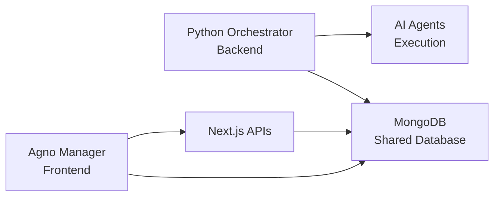

# 🤖 Agno Manager - AI Agent Orchestrator Frontend

> **Frontend interface for the [Python AI Orchestrator Agno](https://github.com/Mosfet04/orquestradorIAPythonArgo)**

A complete web interface for managing AI agents and HTTP tools, designed as a modern frontend that complements the Python AI orchestrator.

> **🙏 Based on [agno-agi Agent UI](https://github.com/agno-agi/agent-ui)** - This project extends and adapts the excellent work from the Agno team for specific integration with the Python orchestrator.


## 📋 About This Project

This project is a **modern web frontend** that complements the [Python AI Orchestrator](https://github.com/Mosfet04/orquestradorIAPythonArgo), providing an intuitive visual interface for:

- **Managing AI agents** without editing Python code
- **Configuring HTTP tools** visually
- **Testing agents** in real-time via chat
- **Administering orchestrator** configurations

### **🔄 Differences from Original Project**

Based on [agno-agi Agent UI](https://github.com/agno-agi/agent-ui), this project adds:

- ✅ **Direct MongoDB integration** (no additional backend needed)
- ✅ **Complete agent CRUD** via web interface
- ✅ **Custom HTTP tools management**
- ✅ **Visual RAG configuration** simplified
- ✅ **Administrative dashboard** for metrics and control
- ✅ **Auto synchronization** with Python orchestrator
- ✅ **Getting started guide** for new users
- ✅ **Multiple provider support** in unified interface

⚡ **Perfect for developers who want to test AI agent orchestration with a modern, intuitive interface.**

## ✨ Key Features

### 🎮 **Chat Playground**
- Modern interface for conversing with AI agents
- Real-time streaming support
- Tool calls and results visualization
- Conversation history
- Multi-modal support (text, image, audio, video)

### 🤖 **Agent Management**
- ➕ **Create agents**: Configure new agents with models, prompts, and tools
- ✏️ **Edit agents**: Modify existing configurations
- 🗑️ **Delete agents**: Remove unused agents
- 🔍 **Search and filter**: Find agents quickly
- 🧠 **RAG configuration**: Configure Retrieval-Augmented Generation
- 🛠️ **Associate tools**: Connect tools to agents

### 🛠️ **HTTP Tools Management**
- ➕ **Create external APIs**: Configure HTTP endpoints visually
- ✏️ **Edit configurations**: Modify URLs, parameters, and headers
- 🗑️ **Delete tools**: Remove unused tools
- 📝 **Dynamic parameters**: Configure input and validation
- 🔗 **Custom headers**: Configure authentication and metadata
- 🔍 **Organize tools**: Search and filter by HTTP method

## 🏗️ Technical Architecture

### **Technology Stack**
- **Frontend**: Next.js 14 + TypeScript + TailwindCSS
- **Components**: Radix UI + shadcn/ui
- **State**: Zustand for global management
- **Forms**: React Hook Form + Zod validation
- **Database**: MongoDB (shared with orchestrator)
- **APIs**: Next.js API Routes (RESTful)

### **Orchestrator Integration**



- ✅ **Zero configuration**: Uses the same MongoDB as orchestrator
- ✅ **Auto synchronization**: Changes reflected instantly
- ✅ **Compatible schema**: 100% compatible with Python structures
- ✅ **Hot reload**: Created agents available immediately

## 📊 Database Structure

### Managed Collections

#### **`agents_config`** - Agent Configuration
```json
{
  "_id": ObjectId("..."),
  "id": "assistant-general",
  "nome": "General Assistant",
  "model": "llama3.2:latest",
  "factoryIaModel": "ollama",
  "descricao": "Assistant for general tasks",
  "prompt": "You are a helpful assistant...",
  "active": true,
  "tools_ids": ["weather-api", "github-api"],
  "rag_config": {
    "active": true,
    "doc_name": "knowledge_base",
    "model": "text-embedding-3-small",
    "factoryIaModel": "openai"
  },
  "created_at": "2025-08-17T10:00:00.000Z",
  "updated_at": "2025-08-17T10:00:00.000Z"
}
```

#### **`tools`** - HTTP Tools
```json
{
  "_id": ObjectId("..."),
  "id": "weather-api",
  "name": "Weather API",
  "description": "Get weather information",
  "http_config": {
    "base_url": "https://api.openweathermap.org",
    "method": "GET",
    "endpoint": "/data/2.5/weather",
    "headers": {
      "API-Key": "your-api-key"
    },
    "parameters": [
      {
        "name": "q",
        "type": "string",
        "description": "City name",
        "required": true
      },
      {
        "name": "units",
        "type": "string",
        "description": "Temperature unit",
        "required": false
      }
    ]
  },
  "created_at": "2025-08-17T10:00:00.000Z",
  "updated_at": "2025-08-17T10:00:00.000Z"
}
```

## 🚀 Quick Start

### **For Beginners**

#### **1. Prerequisites**
```bash
# Node.js 18+ and npm/pnpm installed
node --version  # v18.0.0+
pnpm --version  # 8.0.0+

# MongoDB running (local or cloud)
# Docker (optional, for local MongoDB)
```

#### **2. Orchestrator Setup (Recommended)**
```bash
# Clone and configure Python orchestrator first
git clone https://github.com/Mosfet04/orquestradorIAPythonArgo.git
cd orquestradorIAPythonArgo

# Follow orchestrator README for complete setup
# This ensures MongoDB is configured correctly
```

#### **3. Frontend Configuration**
```bash
# Clone this repository
git clone <this-repository>
cd playgroundOrquestrador

# Install dependencies
pnpm install

# Configure environment variables
cp .env.example .env.local
```

#### **4. Configure `.env.local`**
```env
# MongoDB (same as orchestrator)
MONGO_CONNECTION_STRING=mongodb://localhost:27017
MONGO_DATABASE_NAME=agno

# Application URLs
NEXT_PUBLIC_API_URL=http://localhost:3000

# AI Providers (optional, configure as needed)
OPENAI_API_KEY=your-openai-key
ANTHROPIC_API_KEY=your-anthropic-key
```

#### **5. Run the application**
```bash
# Start development server
pnpm dev

# Access http://localhost:3000
```

#### **6. Sample Data (Optional)**
```bash
# Insert sample data for testing
node sample-data.js

# To remove later: node cleanup-sample-data.js
```

**Sample data includes:**
- 3 configured agents (General Assistant, Programming Expert, Data Analyst)
- 4 HTTP tools (Weather API, World Time API, GitHub API, JSONPlaceholder)
- RAG configuration examples
- Different providers (Ollama, OpenAI, Anthropic)

## 💡 How to Use

### **Basic Configuration Flow**

#### **1. First Run**
1. **Access** `http://localhost:3000`
2. **Follow** the "Getting Started" guide on initial screen
3. **Configure** your first HTTP tool
4. **Create** your first AI agent
5. **Test** in chat playground

#### **2. Creating an HTTP Tool**
```
🛠️ Tools → Create New Tool

📝 Example: Weather API
- ID: weather-api
- Name: Weather API
- Description: Get weather data
- Method: GET
- Base URL: https://api.openweathermap.org
- Endpoint: /data/2.5/weather
- Headers: API-Key: your-key
- Parameters:
  • q (string, required): City name
  • units (string, optional): Temperature unit
```

#### **3. Creating an AI Agent**
```
🤖 Agents → Create New Agent

📝 Example: Weather Assistant
- ID: weather-assistant
- Name: Weather Assistant
- Model: llama3.2:latest (Ollama)
- Prompt: "You are an assistant specialized in..."
- Tools: ✅ weather-api
- RAG: ❌ (disabled)
- Status: ✅ Active
```

#### **4. Testing in Playground**
```
🎮 Playground → Select Agent → weather-assistant

💬 Example conversation:
User: "How's the weather in São Paulo?"
Agent: [Calls weather-api] "In São Paulo it's 25°C, sunny..."
```

### **Supported Providers**

#### **AI Models**
- **🦙 Ollama**: llama3.2:latest, codellama, mistral, etc.
- **🤖 OpenAI**: gpt-4, gpt-3.5-turbo, gpt-4-vision, etc.
- **🧠 Anthropic**: claude-3-sonnet, claude-3-haiku, claude-3-opus
- **💎 Google**: gemini-pro, gemini-pro-vision
- **⚡ Groq**: llama3-70b-8192, mixtral-8x7b-32768
- **☁️ Azure**: OpenAI models via Azure

#### **Embedding Models (RAG)**
- **🦙 Ollama**: nomic-embed-text, mxbai-embed-large
- **🤖 OpenAI**: text-embedding-3-small, text-embedding-3-large
- **💎 Google**: text-embedding-004
- **☁️ Azure**: text-embedding-ada-002

## 🔧 Advanced Development

### **Project Structure**
```
src/
├── app/
│   ├── api/                    # Next.js API Routes
│   │   ├── agents/            # Agent CRUD
│   │   ├── tools/             # Tools CRUD
│   │   └── dashboard/         # Metrics and stats
│   └── page.tsx               # Main page
├── components/
│   ├── layout/                # Navigation and layout
│   ├── management/            # Management screens
│   │   ├── agents/           # Agent components
│   │   ├── tools/            # Tool components
│   │   └── dashboard/        # Dashboard and metrics
│   ├── playground/           # Chat interface
│   └── ui/                   # Base components (shadcn)
├── hooks/                     # Custom React hooks
├── lib/                      # Utilities and configurations
│   ├── mongodb.ts           # MongoDB client
│   ├── utils.ts             # Helper functions
│   └── modelProvider.ts     # Provider configurations
└── types/                    # TypeScript definitions
    ├── management.ts        # Management types
    └── playground.ts        # Playground types
```

### **Adding New Providers**

#### **1. Update TypeScript types**
```typescript
// src/types/management.ts
export type ModelProvider = 
  | 'ollama' 
  | 'openai' 
  | 'anthropic' 
  | 'gemini' 
  | 'groq' 
  | 'azure'
  | 'your-new-provider';  // ← Add here
```

#### **2. Configure in form**
```typescript
// src/components/management/agents/AgentForm.tsx
const modelProviders = [
  // ... existing providers
  { 
    value: 'your-new-provider', 
    label: 'Your New Provider',
    description: 'Provider description'
  }
];
```

#### **3. Add configuration**
```typescript
// src/lib/modelProvider.ts
export const providerConfigs = {
  // ... existing configs
  'your-new-provider': {
    name: 'Your New Provider',
    apiKeyRequired: true,
    supportedModels: ['model-1', 'model-2'],
    embeddingModels: ['embedding-1']
  }
};
```

### **Interface Customization**

#### **Themes and Colors**
```javascript
// tailwind.config.ts
module.exports = {
  theme: {
    extend: {
      colors: {
        primary: {
          50: '#f0f9ff',
          500: '#3b82f6',  // ← Main color
          900: '#1e3a8a'
        }
      }
    }
  }
};
```

## 🔒 Security and Production

### **Security Settings**
```env
# JWT Secrets (secure generation)
NEXTAUTH_SECRET=$(openssl rand -base64 32)

# CORS (production)
NEXT_PUBLIC_ALLOWED_ORIGINS=https://your-domain.com

# Rate Limiting
RATE_LIMIT_WINDOW_MS=900000  # 15 minutes
RATE_LIMIT_MAX_REQUESTS=100  # 100 requests per window
```

### **Recommended Deploy**
```yaml
# docker-compose.prod.yml
version: '3.8'
services:
  agno-manager:
    build: .
    ports:
      - "3000:3000"
    environment:
      - NODE_ENV=production
      - MONGO_CONNECTION_STRING=mongodb://mongo:27017
    depends_on:
      - mongo
      
  mongo:
    image: mongo:7
    ports:
      - "27017:27017"
    volumes:
      - mongodb_data:/data/db
      
volumes:
  mongodb_data:
```

## 📈 Roadmap and Contributions

### **🎯 Current Phase (v1.0)**
- ✅ Complete CRUD for agents and tools
- ✅ Functional chat playground
- ✅ Python orchestrator integration
- ✅ Responsive and modern interface
- ✅ Multiple provider support

### **🚀 Next Features (v1.1)**
- 📊 **Metrics dashboard**: Agent usage, costs, performance
- 👥 **Multi-user**: Authentication and access control
- 📁 **Organization**: Categories and tags for agents
- 🔄 **Versioning**: Change history
- 🌐 **External API**: Webhook endpoints for integration

### **🎨 Future Features (v2.0)**
- 🧪 **A/B Testing**: Compare agent versions
- 📝 **Templates**: Pre-configured agents and tools
- 🔗 **Workflows**: Automated agent chains
- 🏢 **Enterprise**: SSO, audit, compliance
- 📱 **Mobile App**: Native application

### **🤝 How to Contribute**

#### **1. Development Setup**
```bash
# Fork the repository
git clone https://github.com/your-user/agno-manager.git
cd agno-manager

# Install dependencies
pnpm install

# Configure development hooks
pnpm prepare

# Run tests
pnpm test
```

#### **2. Code Standards**
```bash
# Linting and formatting
pnpm lint      # ESLint
pnpm format    # Prettier
pnpm type-check # TypeScript

# Testing
pnpm test           # Unit tests
pnpm test:e2e       # End-to-end tests
pnpm test:coverage  # Coverage report
```

#### **3. PR Submission**
1. **Create an issue** describing the feature/bug
2. **Fork and clone** the repository
3. **Create a branch** feature/feature-name
4. **Implement** following project standards
5. **Add tests** for new functionality
6. **Submit PR** with detailed description

## 📝 License and Credits

### **License**
This project is licensed under [MIT License](./LICENSE).

### **Acknowledgments**
- **[agno-agi Agent UI](https://github.com/agno-agi/agent-ui)** - Base project that inspired and provided the foundation for this interface
- **[Python AI Orchestrator](https://github.com/Mosfet04/orquestradorIAPythonArgo)** - Main backend
- **[Agno Framework](https://agno.link)** - AI agents framework
- **[Next.js](https://nextjs.org)** - React framework
- **[shadcn/ui](https://ui.shadcn.com)** - UI components
- **[TailwindCSS](https://tailwindcss.com)** - CSS framework

### **Community**
- 💬 **Discord**: [Join the community](https://discord.gg/agno)
- 📧 **Email**: support@agno.link
- 🐛 **Issues**: [Report bugs here](https://github.com/your-repo/issues)
- 📖 **Docs**: [Complete documentation](https://docs.agno.link)

---

**⚡ This project is in its initial phase and is actively evolving. Perfect for developers who want to test AI agent orchestration with a modern, intuitive interface.**
